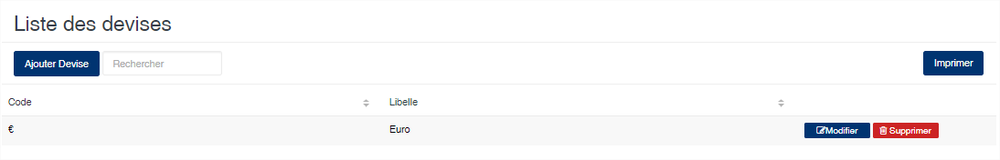
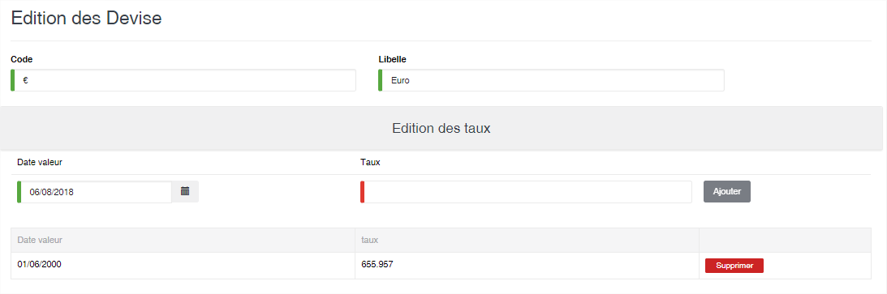

# Devises

Cet option vous permet de gérer les devises étrangères.

### **Edition de la fiche : Devise**

La fiche se divise en deux parties. La première pour le code et la désignation de la devise. Dans la deuxième partie vous retrouvez la liste des valeurs de la devise.

* **Code** : indiquez le code de la devise
* **Libellé** : indiquez la désignation de la devise.
* **Date valeur** : indiquez la date de valeur de la devise
* **Taux** : indiquez le taux de la devise.

