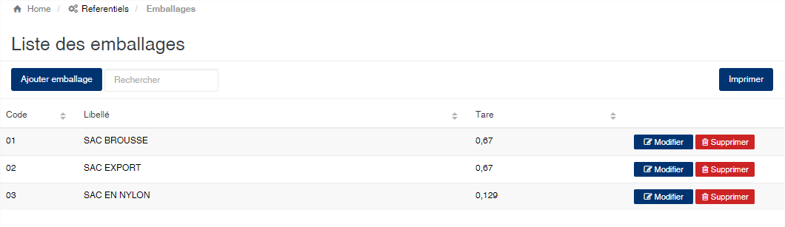
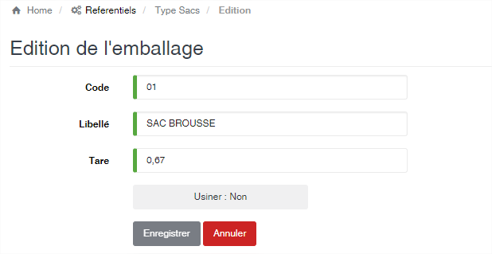

# Emballage

Cette option vous permet d’enregistrer les différents types de sacs utilisés pour le stockage des produits.

### **Edition de la fiche : Emballage**

Toutes les zones de cet écran sont obligatoire.

* **Code** : indiquez le code l'emballage. Le code doit être unique.
* **Libellé** : indiquez la désignation de l'emballage.
* **Tare** : indiquez le poids en kilogramme d'un emballage vide.
* **Usiner (oui/non)** : indiquez ici si le sac est un sac à utiliser ou pas lors de la production. Les sacs avec l'option à **Non**, sont utiliser dans le module achats et ceux avec l'option à **Oui** dans les modules usinage et shipping.

