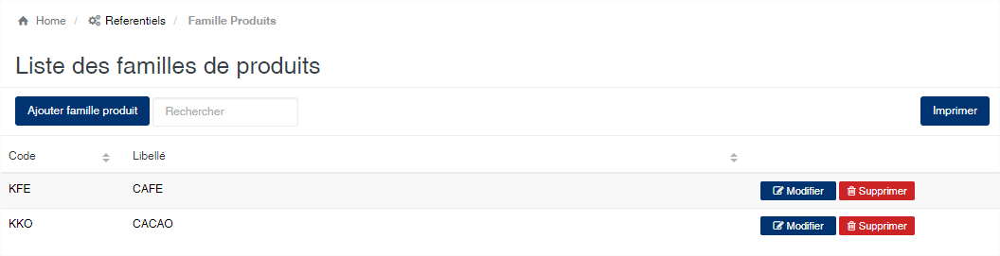
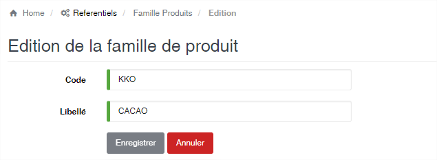

# Famille de Produit

Cette option vous permet d’enregistrer les différentes familles des produits gérées par l’application

### **Edition de la fiche : Famille de Produit**

Toutes les zones de cette fiche sont à remplir obligatoirement.

* **Code** : Code de la famille de produit.
* **Libellé** : indiquez la désignation de la famille de produit.

