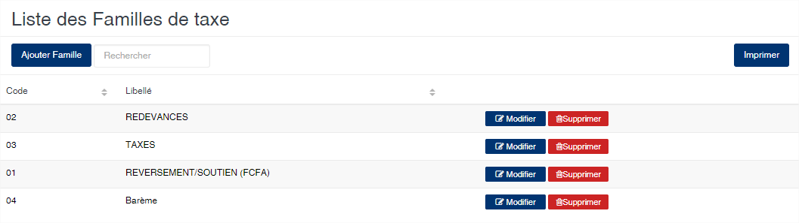
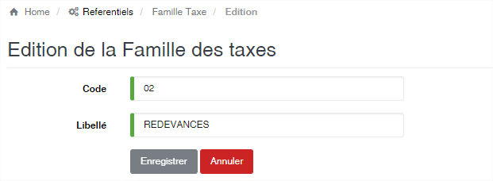

# Famille de Taxe

Cette option vous permet de gérer les familles de taxe. Les taxes sont utilisées au niveau du module export lors de la génération de la formule provisoire.

### **Edition de la fiche : Famille des taxes**

Toutes les zones de cet écran sont obligatoire.

* **Code** : indiquez le code de la famille. Ce code doit être unique.
* **Libelle** : indiquez la désignation de la famille.

