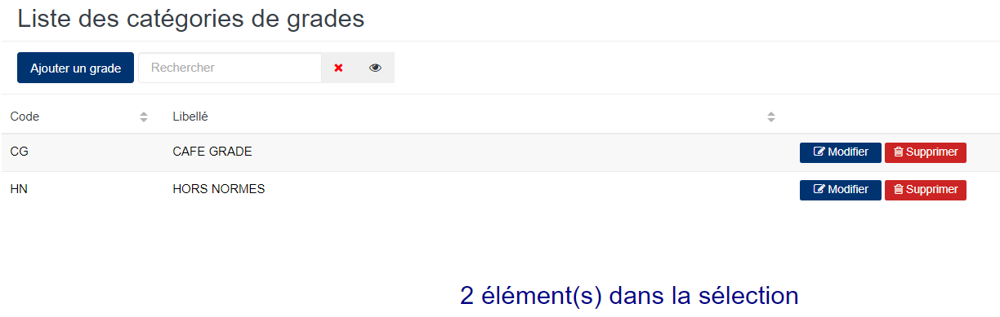
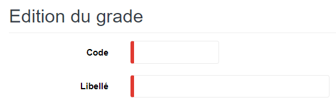
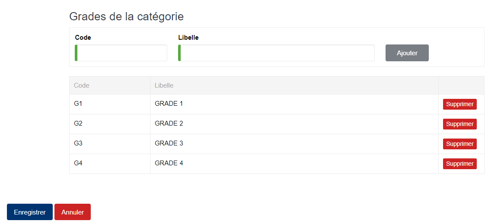

# Grade

Cette option permet de définir les grades qui seront déterminées lors de la détermination des qualités des produits.

### **Edition de la fiche : Grade**

L'écran d'édition de grade se divise en deux parties.

**1ère partie** : Elle vous permet d'indiquer les informations concernant la catégorie de grade.

les zones ci-dessous de cet écran sont obligatoires.

* **Code** : Indiquez le code.
* **Libellé** : Indiquez le libellé.

**2ème partie** : Elle vous permet d'indiquer les grades qui appartiennent à la catégorie ci-dessus mentionnée.

* **Code** : Indiquez le code.
* **Libellé** : Indiquez le libellé.
* **Ajouter** : Cliquez sur le bouton **Ajouter** pour valider la ligne saisie.
* **Supprimer** : Cliquez sur le bouton **Supprimer** pour retirer la ligne erronée ou non souhaitée .

A la fin de votre saisie, afin de valider vos modifications, n'oubliez pas de cliquer sur le bouton **Enregistrer**
