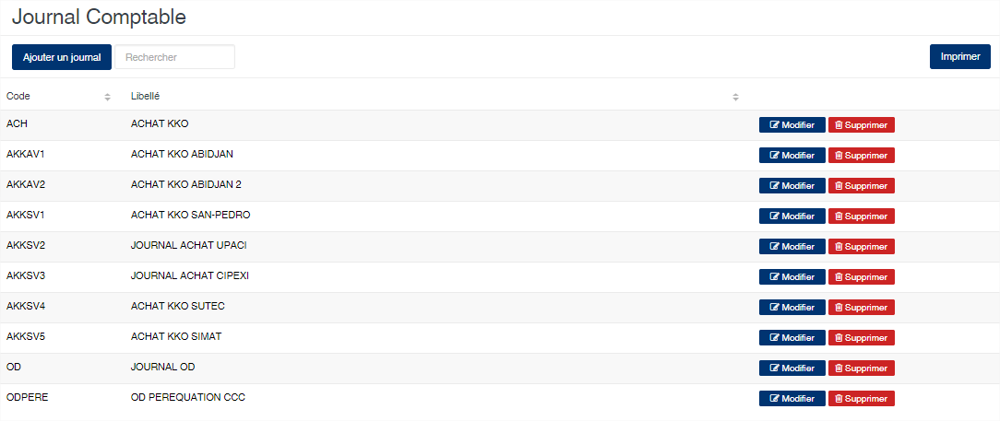

# Groupe Taxe

Cette option vous permet de gérer les regroupements des taxes sur l'édition des formules provisoires au niveau du module Shipping.

### **Edition de la fiche : Groupe de taxe**

Tous les zones sur cette fiche sont obligatoire.

* **Code** : indiquez le code du regroupement. Le code doit être unique.
* **Libellé** : indiquez la désignation du regroupement.
* **Afficher transitaire (oui/non)** : activé, cette option permet l'affichage du nom du transitaire, en plus de la désignation du groupe, lors de l'édition de la formule provisoire.

