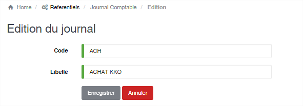

# Journal Comptable

Cette option permet d’enregistrer les journaux comptables utilisés lors de la comptabilisation.

.png>)

### **Edition de la fiche : Journal comptable**

Toutes les zones de cette fiche sont à renseignées obligatoirement.

* **Code** : Indiquez le code du journal.
* **Libellé** : Indiquez la désignation du journal.

