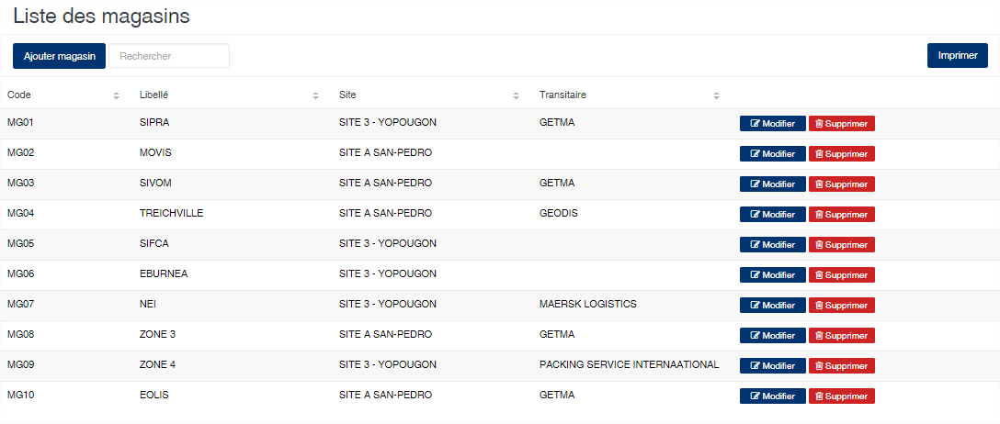
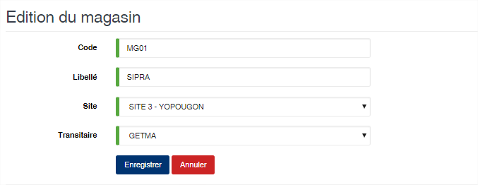

# Magasin

Cette option permet d'enregistrer les magasins de stockage des produits.

### **Edition de la fiche : Magasin**

* **Code** : indiquez le code du magasin.
* **Libellé** : indiquez la désignation du magasin.
* **Site** : sélectionnez le site associé au magasin.
* **Transitaire** : sélectionnez le transitaire propriétaire du magasin. Cette option est facultative.

