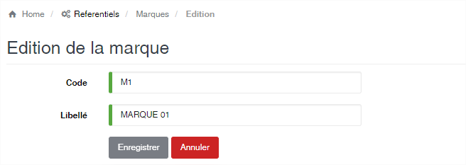

# Marque

Cette option vous permet d’enregistrer les différentes marques des produits gérées par l’application.

.png>)

### **Edition de la fiche : Marque**

Toutes les zones sont obligatoires.

* **Code** : indiquez le code de la marque. Le code doit être unique.
* **Libellé** : indiquez la désignation de la marque.

