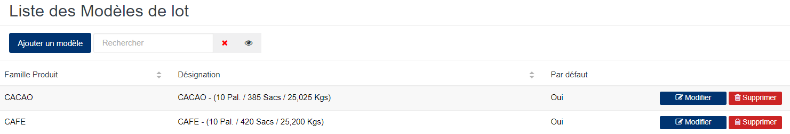
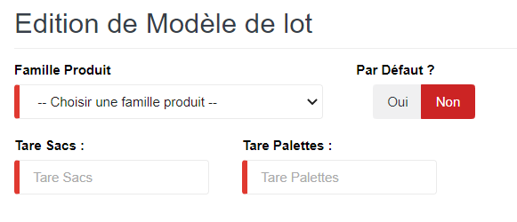
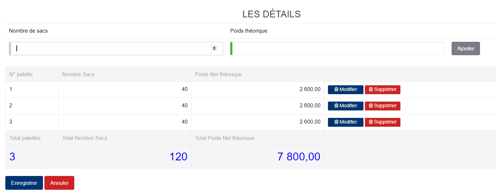

# Modèle Lot

Cette option permet de définir les modèles de lot qui seront utilisé dans la fabrication des lots.

### **Edition de la fiche : Modèle de lot**

L'écran d'édition de modèle de lot se divise en deux parties.

**1ère partie** : Elle vous permet d'indiquer les informations élémentaires sur le modèle de lot.

les zones ci-dessous de cet écran sont obligatoires.

* **Famille Produit** : Indiquez la famille du produit.
* **Tare Sacs** : Indiquez le poids vide des sacs.
* **Tare Palettes** : Indiquez le poids des palettes.
* **Par Défaut?** : Oui, elle indique que ce modèle de lot est utilisé par défaut.

**2ème partie** : Elle vous permet d'indiquer les données théoriques en terme de nombre de sacs et du tonnage des lots.

* **Nombre de sacs** : Indiquez le nombre de sac théorique.
* **Poids théorique** : Indiquez le poids théorique.
* **Ajouter** : Cliquez sur le bouton **Ajouter** pour valider la ligne saisie.
* **Supprimer** : Cliquez sur le bouton **Supprimer** pour retirer la ligne erronée ou non souhaitée .

