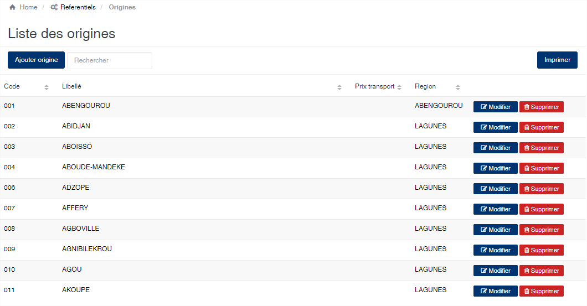
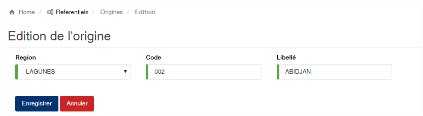

# Origine de Produit

Cette option vous permet d’enregistrer les villes d’origine des produits.

### **Edition de la fiche : Origine**

Toutes les zones de cette fiche sont obligatoires à remplir.

* **Région** : sélectionnez la région d’appartenance de l’origine.
* **Code** : indiquez le code de l’origine. Ce code est unique dans l’application.
* **Libellé** : indiquez la désignation de l’origine.

