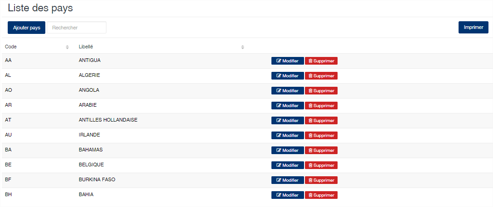

# Pays

Cette option permet de définir le répertoire des pays.

### **Edition de la fiche : Pays**

Toutes les zones de cette fiche doivent obligatoirement être renseignées.

* **Code** : indiquez le code du pays. Nous recommandons d'indiquez le code ISO du pays.
* **Libellé** : indiquez le nom du pays.

