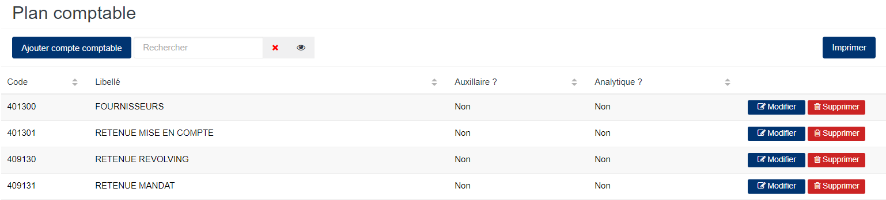
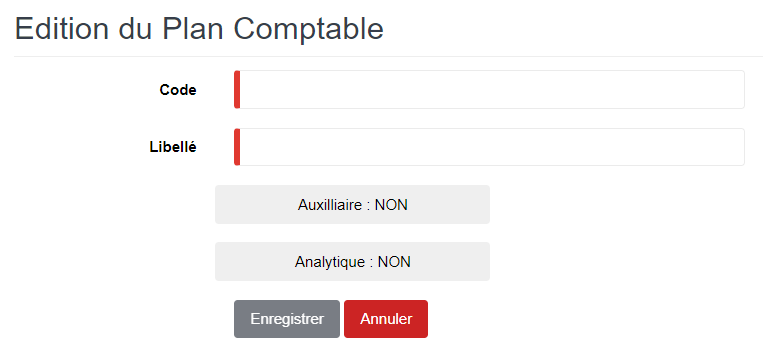

# Plan Comptable

Cette option permet de définir le plan comptable qui sera utilisé dans la comptabilisation.

### **Edition de la fiche : Plan comptable**

les zones ci-dessous de cet écran sont obligatoires.

* **Code** : Indiquez le code.
* **Libellé** : Indiquez le libellé.
* **Auxiliaire** : Oui, elle indique que ce plan est utilisé dans la comptabilité auxiliaire.
* **Analytique** : Oui, elle indique que ce plan est utilisé dans la comptabilité analytique.

