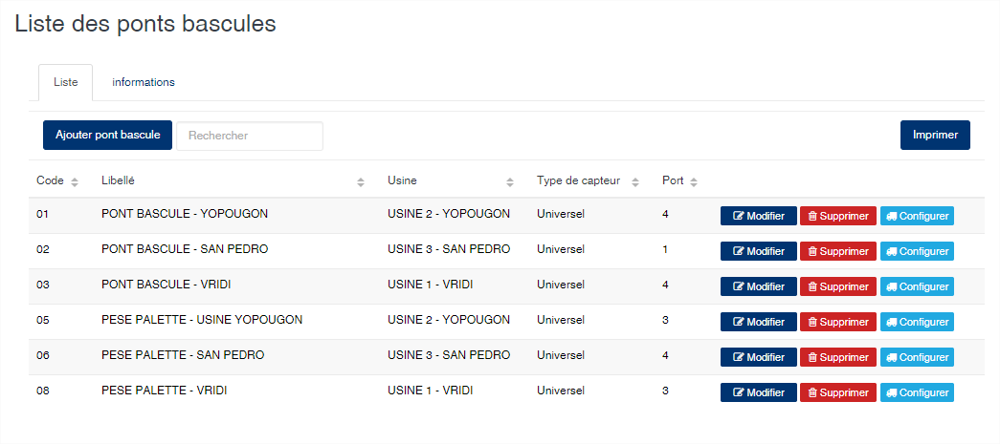
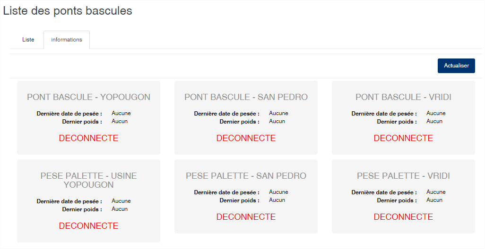
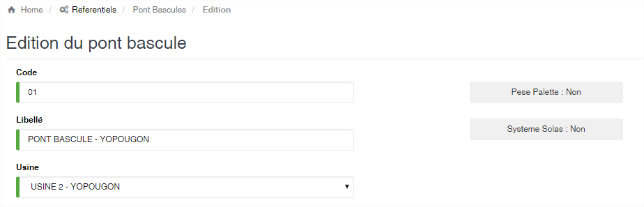
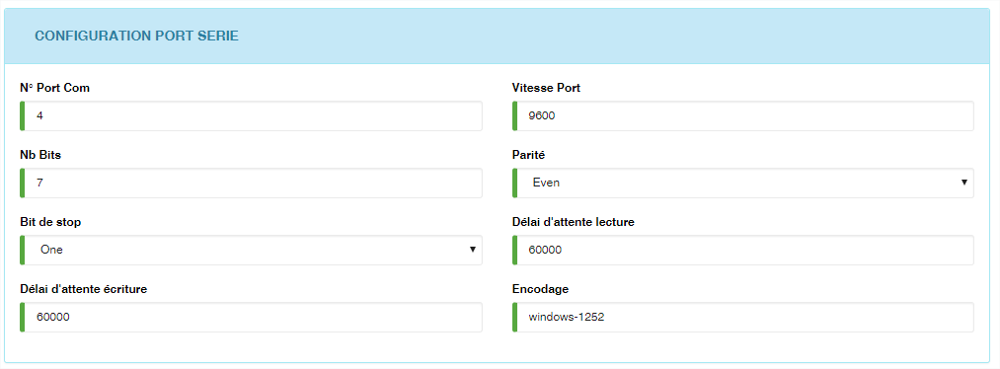

# Ponts Bascule

Cette option permet de définir les ponts bascules utilisés pour peser le produit. La liste des ponts bascules vous propose deux onglets :

* **Liste** : vous affiche la liste des ponts bascules enregistrés dans l'application.
* **Informations** : vous affiche l'état, en temps réels, des ponts bascules et d'effectuer une lecture à distance du poids.

Le bouton **Configurer** permet de configurer le logiciel de lecture de poids automatique des ponts bascules. Ce logiciel est **SIGAM Extension** qui fait l'objet d'une autre documentation que vous trouverez ici.

### **Edition de la fiche : Pont bascule**

La fiche de saisie des ponts bascules se découpe en trois parties qui sont :

* **Les informations signalétiques du pont bascule.**
* **Code** : Indiquez le code du pont bascule. Ce code est unique et obligatoire dans l’application.
* **Libellé** : Indiquez la désignation du pont bascule. Cette zone est obligatoire.
* **Usine** : Sélectionnez l’usine où se trouve le pont bascule.
* **Pèse palette** : Activé cela indique que le pont est une pèse palette. Il sera utilisé uniquement dans le cas de l’usinage des produits.
* **Système Solas** : Activé cela indique que le pont sera utilisé pour les pesées dans le cadre la convention Solas.

* **Les informations sur la lecture du capteur de poids.**

Cette zone permet de définir le type de lecteur auquel SIGAM doit se connecter afin de récupérer automatiquement le poids sur le pont bascule.

* **Type de capteur** : sélectionnez le type de capteur que vous souhaitez configurer. Le capteur **Universel** est un type de capteur spécifique à SIGAM et dont la lecture est totalement paramétrable en fonction des informations renseignées dans cette zone. Les autres capteur (Arpège, Giropes, Ohaus et Telemetrix) ont une configuration de base interne à SIGAM qui ne peut être modifié.&#x20;
* **Caractère de début** : indiquez ici le première caractère à rechercher afin de déterminer la position du poids dans la trame de lecture du port série de l'ordinateur.
* **Caractère de fin** : indiquez le caractère à rechercher afin de déterminer la fin de la chaîne à récupérer dans la trame de données du port série.
* **Position Extraction** : après la détermination de la chaîne contenant le poids à partir du caractère de début et de fin, cette zone permet de localiser le poids.
* **Longueur Extraction** : indiquez ici la longueur de la chaîne représentant le poids.
* **Envoyer commande** : activé, cette zone indique que le lecteur devra envoyer une commande au port série afin de lancer la lecture du poids.
* **Commande** : indiquez ici la commande à exécuter si le bouton  est activé.

**Attention :** Pour une lecture automatique du poids, il faut que le pont bascule soit connecté à l'ordinateur devant effectuer les pesées, via le port série. De même l'application SIGAM Extension doit être installée et configurée sur l'ordinateur connecté au pont bascule.

.png>)

**Note** : Dans la majeure partie des cas, nous recommandons l'utilisation du capteur Universel. Il est le seul à pouvoir s'adapter à toute les situations et l'ensemble des capteurs présents sur le marché. Ce capteur sera le seul disponible dans les prochaines versions de SIGAM.

* **La configuration du port série**

Cette zone permet de définir les paramètres d'accès au port série pour la lecture du pont bascule.

* **N° Port Com** : Veuillez indiquer le numéro de port de communication série utilisé par le capteur du pont bascule (1 = COM1, 2=COM2, etc.).
* **Vitesse Port** : indiquez la vitesse du port à utiliser.
* **Nb Bits** : indiquez le nombre de bits de parité.
* **Parité** : sélectionnez la parité.
* **Bit de stop** : sélection de type de bit de stop.
* **Délai d'attente lecture** : indiquez le délai d'attente en milliseconde en mode lecture.
* **Délai d'attente écriture** : indiquez le délai d'attente en milliseconde en mode d'écriture.
* **Encodage** : indiquez l'encodage à appliquer si nécessaire.

