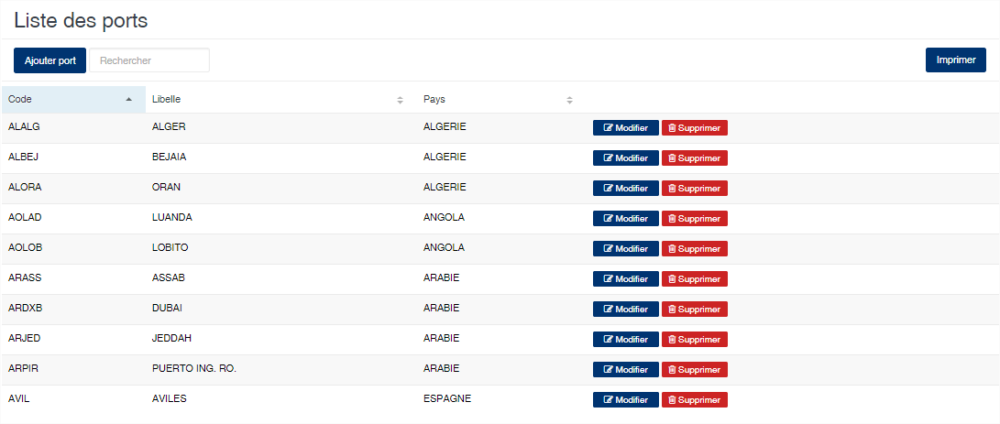
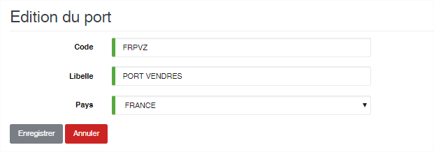

# Ports

Cette option permet d'enregistrer les ports maritimes.

### **Edition de la fiche : Port maritime**

Toutes les zones de cette fiche doivent être renseignées.

* **Code** : indiquez le code du port. Nous vous conseillons d'indiquer le code international du port si possible.
* **Libellé** : indiquez le nom du port
* **Pays** : sélectionnez le pays auquel appartient le port.

