# Produit

Cette option vous permet de gérer les produits pour les opérations au sein de l’application. La notion de produit est l’un des points importants de l’application. Les différentes options présentes dans la fiche de produit permettent de définir des paramètres de fonctionnement de l’application.

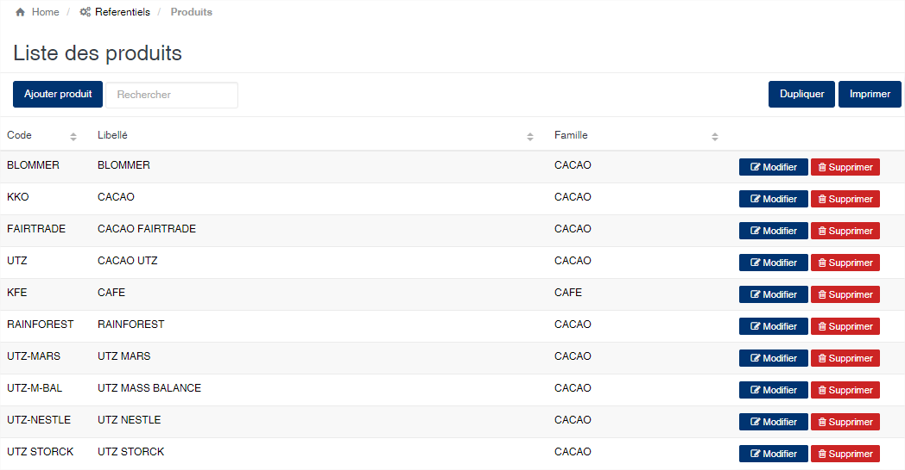

### **Edition de la fiche : Produit**

La fiche de gestion des produits présente plusieurs onglets qui sont :

* Information
* Comptabilisation
* Analyse achat
* Analyse Usinage
* Qualités
* Réfactions
* Journaux
* Périodes
* Conteneurs
* Prix de référence

**Onglet : Information**

Cet onglet vous permet de définir les informations signalétiques du produit.

* **Code** : indiquez le code du produit. Cette zone est obligatoire.
* **Famille** : sélectionnez la famille associé à ce produit. Cette zone est obligatoire.
* **Libellé** : indiquez la désignation du produit. Cette zone est obligatoire.
* **Nomenclature douanière** : indiquez s'il y a lieu la nomenclature douanière associé à ce produit. Cette nomenclature s'affichera sur les documents d'exportation.
* **Retenue BIC** : indiquez le montant par kilogramme de la retenue à la source du BIC.
* **Prime** : indiquez le taux par kilogramme à appliquer pour la détermination des primes de campagne à payer aux fournisseurs en fin de campagne (voir état des primes).
* **Libellé En** : indiquez le nom en anglais du produit.&#x20;
* **Libellé Fr** : indiquez le nom en français du produit.&#x20;
* **Délai de revolving** : indiquez le délai des première livraison dans le cadre d'un contrat de financement en revolving.
* **Prime de certification** : indiquez le montant par kilogramme de la prime de certification des produits.

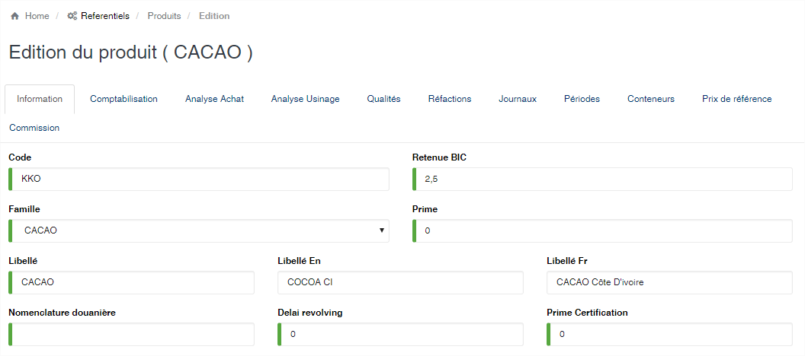

* Vérification des connaissements refoulés
  * **Nombre de jours** : indiquez le nombre de jours avant qu'un camion refoulés puisse de présenter à l'entrée de l'usine. La vérification du camion se fait sur son immatriculation. Si un camion refoulé est saisie dans un délai inférieur à ce nombre de jours, il sera automatiquement rejeté par l'application.
  * **Tolérance de poids** : indiquez l'écart minimum entre le poids du camion refoulé et son poids lorsque qu'il se représente à l'entrée de l'usine. Si l'écart est inférieur à cette valeur, alors le produit sera rejeté par l'application. Cela indique une suspicion de représentation d'un produit déjà refoulé.
* Tolérance sur poids net du lot
  * **Poids min** : indiquez ici le poids minimum qu'un lot doit avoir en poids net, lors de la production.
  * **Poids max** : indiquez ici le poids maximum qu'un lot doit avoir en poids net lors de la production.
* Lot
  * **Tare Sac Théorique** : indiquez la tare théorique des sacs vides d'un lot.
  * **Tare Palette Théorique** : indiquez la tare théorique des palettes d'un lot.
* Caution bancaire
  * **Taux de caution** : indiquez ici le taux de caution bancaire pour l'exécution des contrats exports
  * **Autorité** : indiquez ici le nom de l'autorité nationale à qui adressé les règlements des taxes.

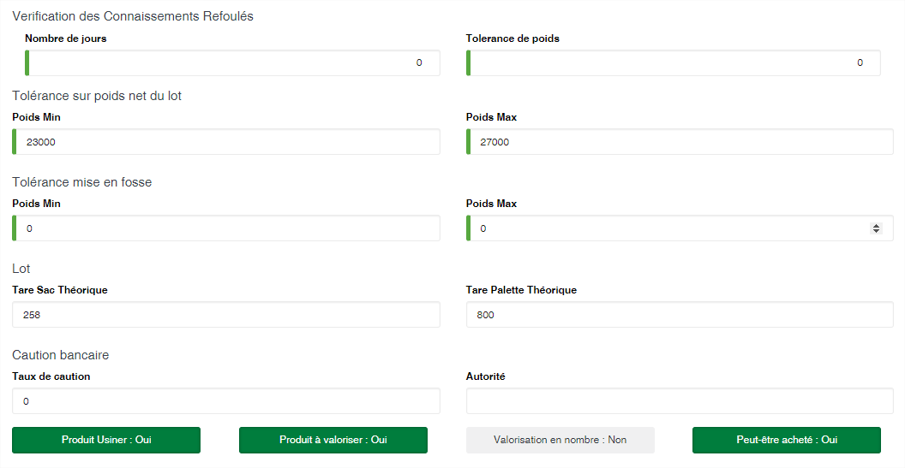

* **Produit Usiner (Oui/Non)** : Activé, cet bouton indique que le produit fait l'objet d'un usinage. Seul les produits ayant le bouton à **Oui** peuvent être utilisé dans le module Usinage
* **Produit à valoriser (Oui/Non)** :Activé, cet bouton indique que le produit fait l'objet d'une facturation. Seule les produits ayant le bouton à **Oui** peuvent apparaître dans le module de trésorerie.
* **Valoriser en nombre (Oui/Non)** : Activé, cet bouton indique que le produit se facturer sur la base de la quantité ou sur son poids.
* **Peut-être acheté (Oui/Non)** : Activé, cet bouton indique que le produit peut faire l'objet d'un achat et donc être utilisé dans les entrées de produits brousse, etc.

**Onglet : Comptabilisation**

Cet onglet permet de définir les informations qui seront utilisées lors de la génération des écritures comptable des opérations d’achats.

**Attention** : Les éléments de cet onglet sont tous optionnels. Ils dépendront des schémas d’écriture de comptabilisation des achats en vigueur dans votre entreprise. Les racines peuvent être utilisées en analytique ou en tiers en fonction du model de comptabilisation de votre entreprise. Lors de l’installation de l’application dans votre entreprise la modélisation comptable sera définie avec vos services comptables et/ou financiers.

* **Racine analytique** : Indiquez la racine analytique associée au produit.
* **Racine avance** : Indiquez la racine à afficher dans le cas d’une avance.
* **Racine BIC** : Indiquez la racine à afficher dans le cas de la retenue BIC.
* **Racine Mandat** : Indiquez la racine à afficher dans le cas d’un mandat.
* **Racine mis en compte** : Indiquez la racine à afficher dans le cas des mises en compte.
* **Racine revolving** : Indiquez la racine à afficher dans le cas des révolvings.
* **Journal** : Indiquez le journal principal à utiliser pour la comptabilisation des achats.
* **Compte achat** : Indiquez le compte général de charge des achats du produit.
* **Compte avance** : Indiquez le compte général pour les avances.
* **Compte BIC** : Indiquez le compte général pour les retenues BIC.
* **Compte mandat** : Indiquez le compte général pour les mandats.
* **Compte mise en compte** : Indiquez le compte général pour les mises en compte.
* **Compte revolving** : Indiquez le compte général pour les révolvings.
* **Compte tiers** : Indiquez le compte général auxiliaire pour les achats.
* **CG Soutien Transport (débit)** : indiquez les compte général à utiliser au débit des écritures de comptabilisation de la péréquation transport dans le cadre des soutiens
* **CG Soutien Transport (crédit)** : indiquez le compte général à utiliser au crédit des écritures de comptabilisation de la péréquation transport dans le cadre des soutiens.
* **CG Reversement Transport (débit)** : indiquez le compte général à utiliser au débit des écritures de comptabilisation de la péréquation transport dans le cadre des reversements.
* **CG Reversement Transport (crédit)** : indiquez le compte général à utiliser au crédit des écritures de comptabilisation de la péréquation transport dans le cadre des reversements.

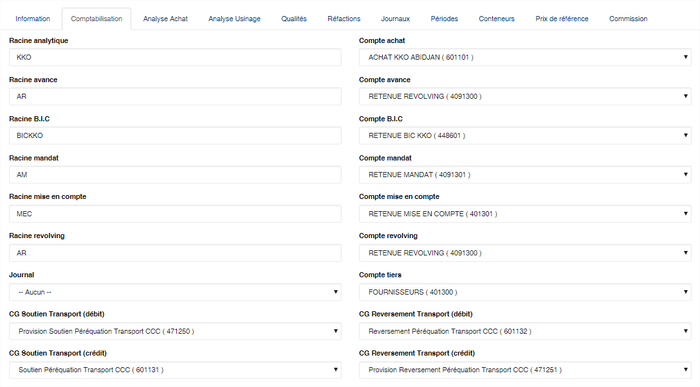

**Onglet : Analyse achat**

Cet onglet vous permet de définir les paramètres d’analyse des produits dans le module achats. L’écran se divise en deux parties. Une partie vous permettant de définir les informations à ajouter, et une liste en dessous présentant les données déjà existantes. _\*Type analyse_ : sélectionnez le type d'analyse dans la liste.

* **Minimum** : indiquez la valeur minimum acceptable pour l'analyse
* **Maximum** : indiquez la valeur maximum acceptable pour l'analyse;
* **Base calcul** : indiquez la base de calcul. La base représente le poids de l'échantillon à analyser.
* **Bouton** : cliquez sur ce bouton pour ajouter l'analyse à la liste en dessous.

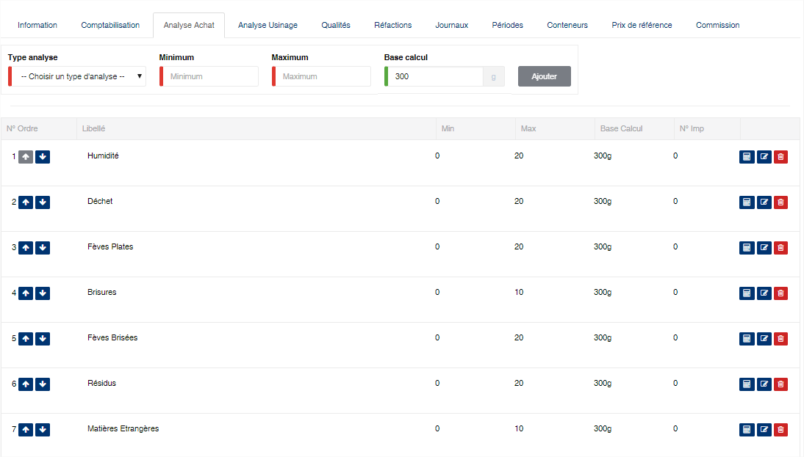

La liste vous présente une série de boutons :

* **A droite** : avec les flèches « **haut** » et « **bas** » vous pouvez modifier l’ordre des analyses. Cet ordre sera utilisé pour la saisie des valeurs d’analyses.
* **A gauche** : les boutons  «calculatrice«, « modifier » et « supprimer » vous permettent respectivement de saisir une formule de calcul, modifier ou supprimer l’élément sélectionné.

Le bouton représentant une calculatrice vous affichera l'écran ci-dessous. Il permet de définir la formule de calcul de la valeur de l'analyse. Les analyses ayant une formule, ne peuvent pas faire l'objet de saisie. Leur valeur est automatique calculée par le programme.

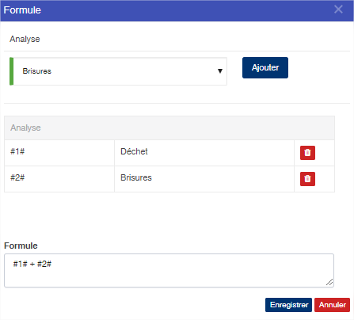

**Onglet : Analyse usinage**

Cet onglet vous permet de définir les paramètres d’analyse des produits dans le module usinage. Le fonctionnement de cet onglet est identique à celui des **analyses pour les achats**.

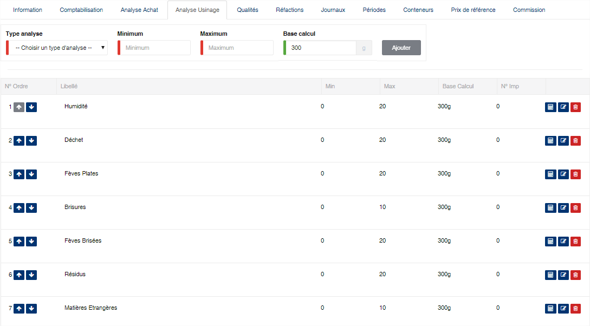

**Onglet : Qualités**

Cet onglet vous permet de définir les paramètres de détermination de la qualité des produits achetés ou usinés. Cet écran se divise en deux parties. La première partie permet d’indiquer pour une qualité, l’analyse associée et les valeurs minimum et maximum autorisées. La deuxième présente le détail des analyses par qualité que vous avez déjà saisie.

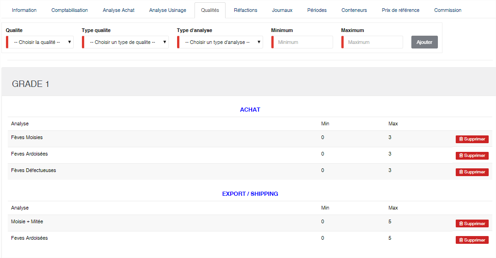

**Note** : Lors de la validation de l’analyse, le programme comparera les valeurs d’analyses saisies aux valeurs définis dans cet onglet afin de déterminer automatiquement la qualité des produits. Dans le cas des achats, les analyses sont automatiquement refusées par le programme lorsque la qualité ne peut pas être déterminée à partir des analyses saisies.

**Onglet : Réfactions**

Cet onglet permet de définir les paramètres de détermination de la réfaction à appliquer sur les achats Le logiciel offre deux types de réfactions :

* **Réfaction sur le poids** : Appliquée au moment de la validation des achats.
* **Réfaction financière** : Appliquée au moment du règlement des achats.

La zone de définition des éléments de réfaction vous permet de les ajouter à la liste se trouvant en dessous

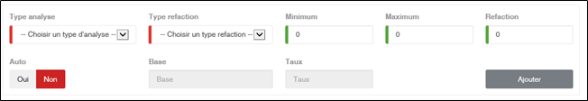

* **Type Analyse** : Sélectionnez l’analyse servant de critère de réfaction.
* **Type de réfaction** : Sélectionnez le type de la réfaction (sur poids ou financière).
* **Minimum** : Indiquez la valeur minimum autorisée.
* **Maximum** : Indiquez la valeur maximum autorisée.
* **Réfaction** : indiquez la valeur de réfaction à appliquer. Cette valeur n’est pas utilisé sur le bouton a bascule est sur « Oui ».
* **Auto** : Indique que la valeur de réfaction est déterminée automatiquement par le programme en se basant sur les éléments « Base » et « Taux ».
* **Base** : Cette zone s’active si le bouton « Auto » à la valeur « Oui ». Cette zone indique la valeur de base à partir de laquelle la réfaction doit être calculée.
* **Taux** : Cette zone s’active si le bouton « Auto » à la valeur « Oui ». Cette zone indique le multiplicateur à appliquer sur la différence entre la base et la valeur d’analyse.

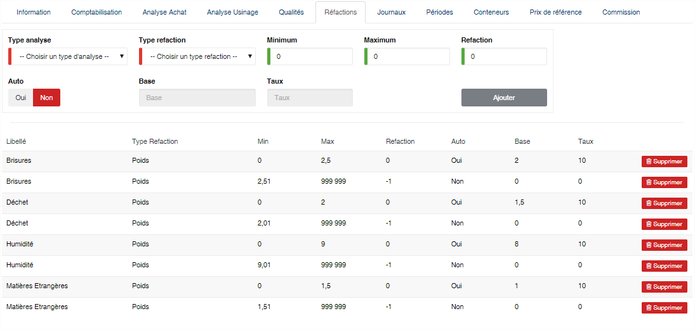

**Attention** : Lorsque le bouton « Auto » est à « Non » et que la zone « Réfaction » à une valeur négative, cela indique au système que toute analyse correspondant aux bornes associées doit être systématiquement refusée.

**Onglet : Journaux**

Cet onglet permet de définir les journaux à utiliser par usines lors de la comptabilisation des écritures L'écran se divise en deux parties. La partie du haut vous permet de saisir vous informations sur les journaux et de les ajouter dans la liste en dessous via le bouton .

* **Usine** : sélectionnez l'usine pour laquelle vous configurer le journal
* **Journal** : sélectionnez le journal à configurer
* **Type** : sélectionnez le type du journal (Journal d'achat, journal d'OD, journal de vente export, journal de vente local, journal des OD de transport).
* **Compte général** : sélectionnez le compte général de contrepartie du journal.
* **Plan analytique** : indiquez le numéro de plan analytique pour les écritures de type analytique.

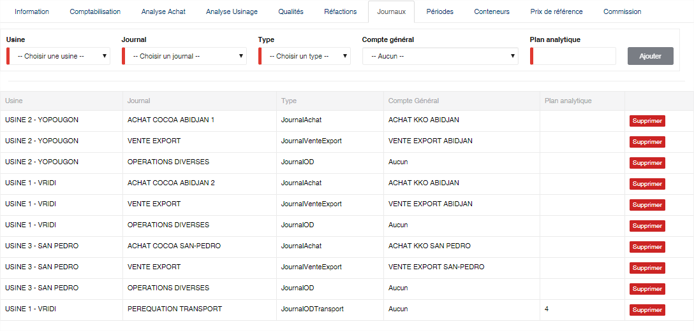

**Onglet : Périodes**

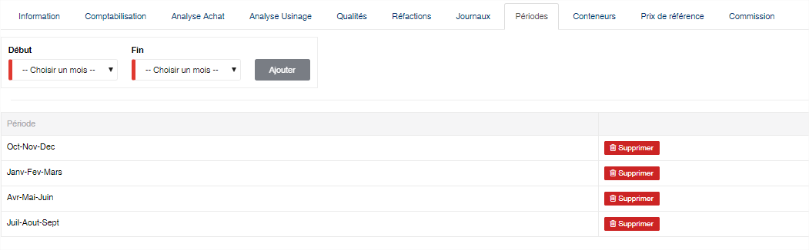

**Onglet : Conteneurs**

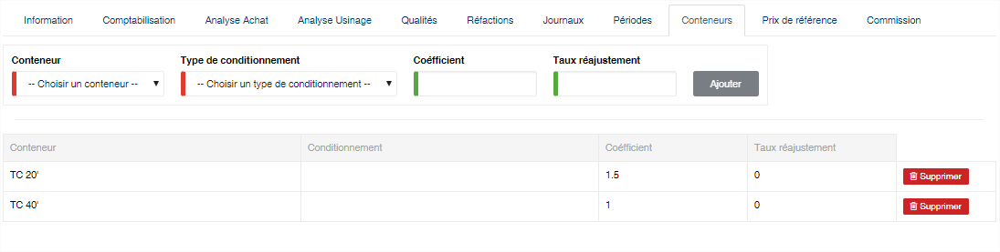

**Onglet : Prix de référence**

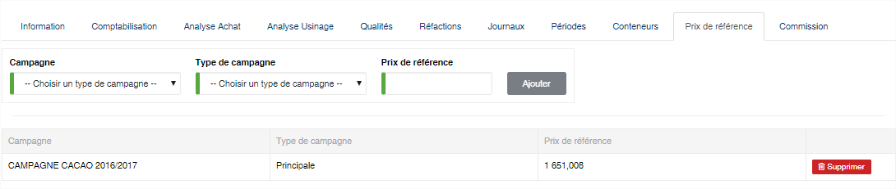

**Onglet : Commission**

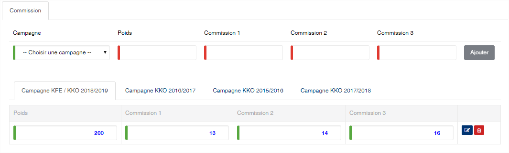
