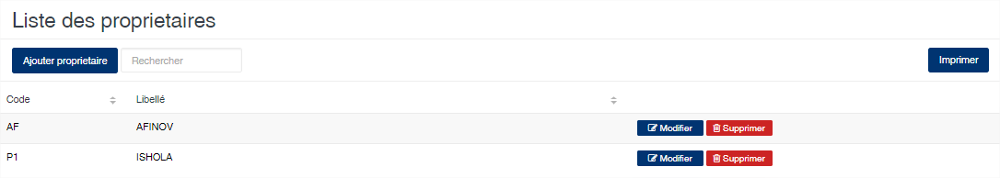
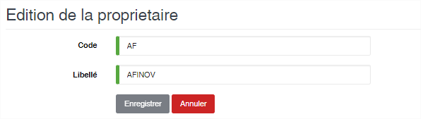

# Propriétaire

Cette option vous permet d’enregistrer les différents propriétaires des produits gérés dans l’application.

### **Edition de la fiche : Propriétaire**

Toutes les informations sur cette fiche sont obligatoire.

* **Code** : Indiquez le code du propriétaire.
* **Libellé** : Indiquez un libellé du propriétaire.

