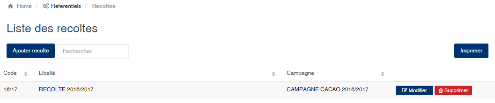
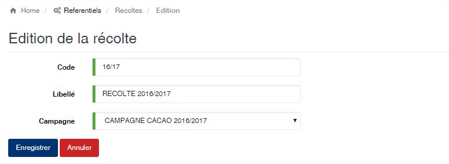

# Recolte

Cette option vous permet de gérer les récoltes liées à la campagne.

### **Edition de la fiche : Récolte**

Toutes les zones de cet écran sont obligatoire.

* **Code** : indiquez le code de la récolte. Le code doit être unique.
* **Libellé** : indiquez ici la désignation de la récolte
* **Campagne** : sélectionnez la campagne à associer à votre récolte

