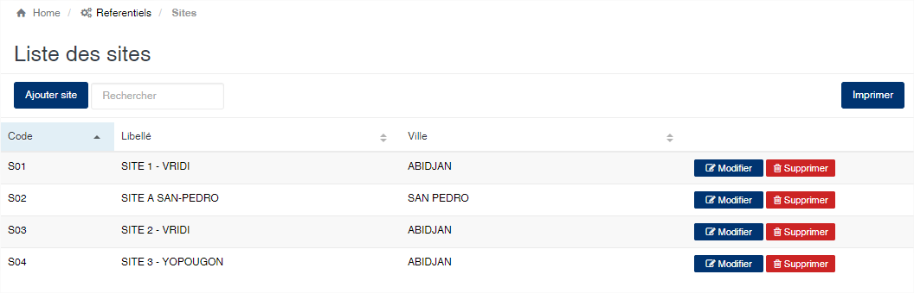
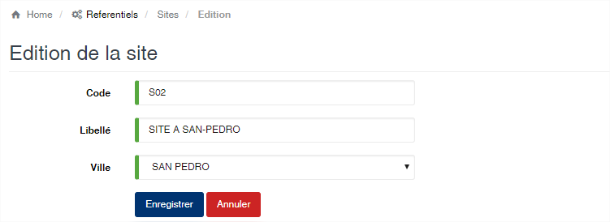

# Site

Cette option vous permet de gérer les sites de l'entreprise. Les sites représentent la zone géographique de localisation des magasins et usines.

### **Edition de la fiche : Site**

Toutes les zones de cet écran sont obligatoire.

* **Code** : indiquez le code du site. Le code doit être unique.
* **Libelle** : indiquez la désignation du site.
* **Ville** : sélectionnez la ville de localisation du site.

