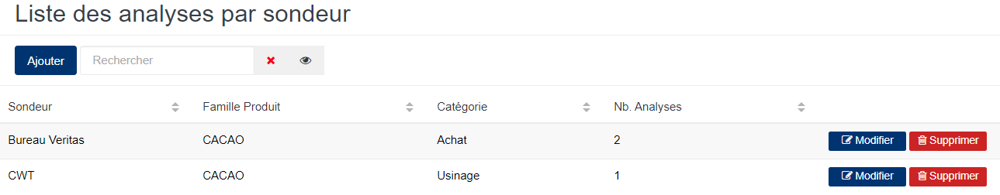
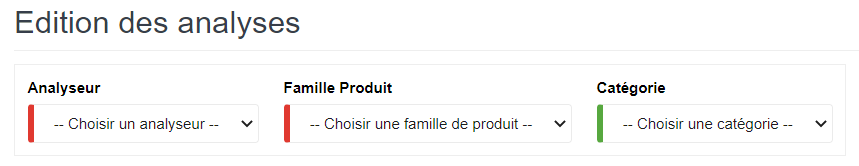
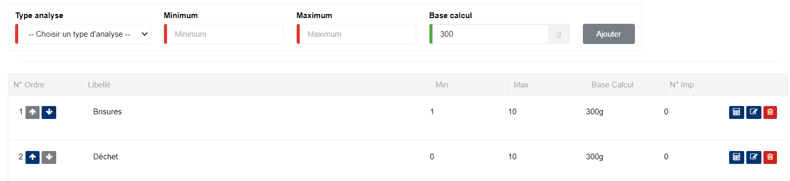

# Sondeur Analyse

Cette option permet de définir les sondeurs habilités à faire les prélèvement d'échantillon sur les produits.

### **Edition de la fiche : Sondeur analyse**

L'écran d'édition du sondeur se divise en deux parties.

**1ère partie** : Elle vous permet d'indiquer les informations élémentaires sur l'analyseur.

les zones ci-dessous de cet écran sont obligatoires.

* **Analyseur** : Indiquez la société intervenante.
* **Famille Produit** : Indiquez la famille du produit.
* **Catégorie** : Indiquez la catégorie d'activité.

**2ème partie** : Elle vous permet d'indiquer les critères qui feront l'objet d'analyse par l'analyseur.

* **Type d'analyse** : Indiquez le type d'analyse(critère d'analyse).
* **Minimum** : Indiquez la borne minimale.
* **Maximum** : Indiquez la borne maximale.
* **Base calcul** : Indiquez le poids de l'échantillon analysé.
* **Ajouter** : Cliquez sur le bouton **Ajouter** pour valider la ligne saisie.
* **Supprimer** : Cliquez sur le bouton **Supprimer** pour retirer la ligne erronée ou non souhaitée .

