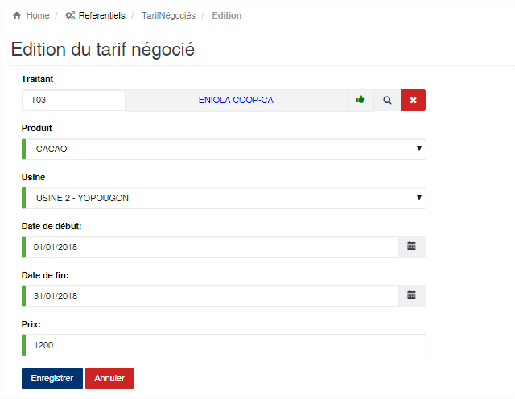

# Tarif négocié

Cette option vous permet de définir le prix d’achat négocié pour un fournisseur et pour une période donnée. Durant toute la période définie le prix indiqué sera automatiquement appliqué aux achats effectués avec ce fournisseur.

### **Edition de la fiche : Tarif négocié**

Toutes les zones sont obligatoires sur cette fiche.

* **Traitant** : Sélectionnez le traitant.
* **Produit** : Sélectionnez le produit.
* **Usine** : Sélectionnez l’usine où les achats seront effectués.
* **Date de début et date de fin** : Indiquez la période de validité du prix.
* **Prix** : Indiquez le prix d’achat pour la période et pour le fournisseur.

