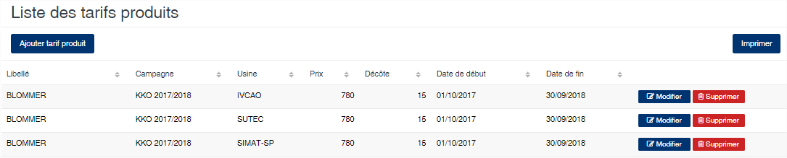
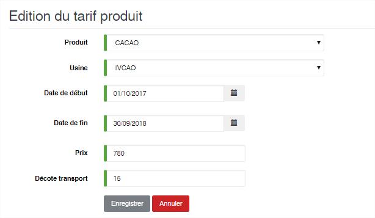

# Tarif produit

Cette option permet de définir le prix d’achat des produits par usine et par période. Les prix définis dans cette option sont automatiquement utilisés pour la gestion des règlements des produits.

### **Edition de la fiche : Tarif produit**

* **Produit** : Sélectionnez le produit sur lequel définir le prix d’achat.
* **Usine** : Sélectionnez l’usine à laquelle le prix s’appliquera.
* **Date de début et Date de fin** : Indiquez la période de validité du prix.
* **Prix** : Indiquez le prix à appliquer pour la période, l’usine et le produit sélectionnés précédemment.
* **Décote transport** : indiquez la valeur du transport dans le prix d'achat. Cette valeur sera utilisé dans le calcul du reversement ou du soutien dans le cas de la péréquation transport.

