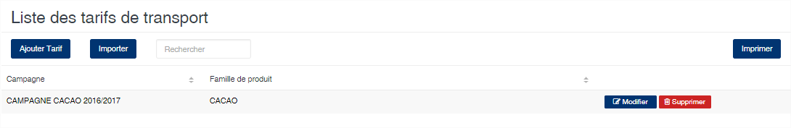

# Tarif transport

Cette fonction permet de définir la table de péréquation transport. Cette table est enregistrée en fonction de la campagne et de la famille de produit. Elle permet de déterminer le prix du transport entre deux villes. Généralement elle indique la ville d'origine des produits et la ville de destination de réception où se trouvent les usines.

Le bouton importer vous permet d'importer un fichier excel contenant la table au lieu et place de la saisir. Vous pouvez télécharger le fichier suivant afin d'avoir la trame à respecter pour l'importation des données de transport.\
:download:`Model de fichier excel pour l'importation du transport </files/Bareme_Perequation_Transport_2017.xlsx>`

### **Edition de la fiche : Tarif transport**

Indiquez la **ville de départ**, puis la **ville de destination** et le **prix du transport** associé. Le bouton **Ajouter**, ajoute à la liste votre saisie.

