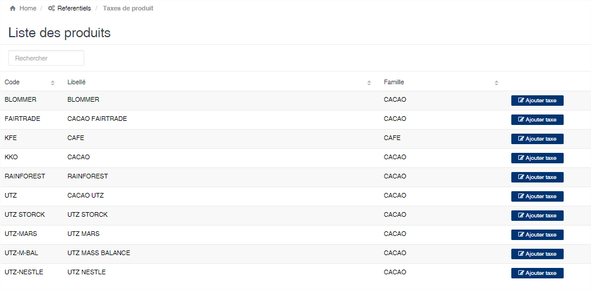
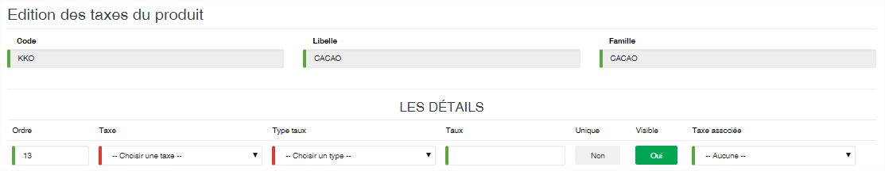
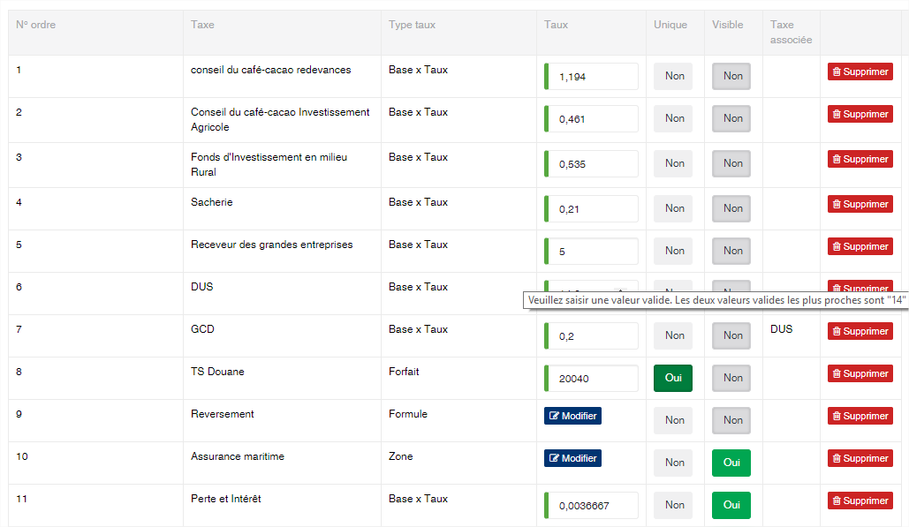
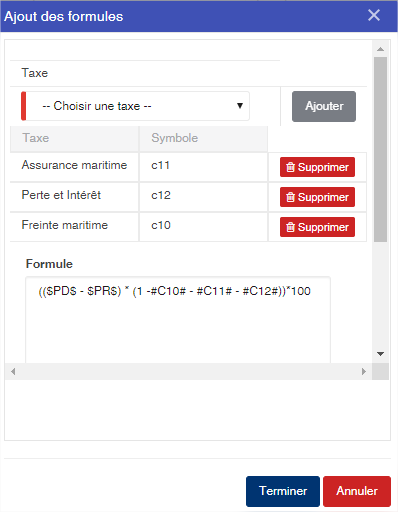

# Taxe / Produit

Cette option permet de définir les taxes à payer. Ces taxes sont générés lors de l'édition de formule provisoire dans le module shipping. La liste vous affiche automatiquement les produits enregistrés dans l'application. Pour définir les taxes d'un produit, veuillez cliquer sur le bouton « **Ajouter taxe** »

### **Edition de la fiche : Taxe de produit**

Cette fiche se divise en deux parties. La première partie vous est la zone de saisie des taxes et la deuxième partie affiche la liste des taxes.

* **Ordre** : indiquez l'ordre d'affichage de la taxe dans la formule provisoire.
* **Taxe** : sélectionnez la taxe dans la liste des taxes.
* **Type taux** : sélectionnez le type de taux. Cela permet de déterminer le mode de calcul de la taxe. Vous avez les valeurs suivantes :
  * Base x Taux : La valeur du contrat sera multiplié par le taux indiqué.
  * Forfait : La valeur indiqué est celle qui figurera sur la formule provisoire
  * Formule : Une formule devra être définie afin de déterminer la valeur de la taxe.
  * Zone : Le taux de la taxe est définie en fonction des zones géographique de destination des produits
* **Unique (Oui/Non)** : Activé, cela indique que cette taxe sera généré une seule fois par rapport au contrat export.
* **Visible (Oui/Non)** : Activé, cela indique que la taxe doit apparaître sur la formule provisoire.
* **Taxe associée** : lorsqu'une taxe est sélectionnée, la base de calcul sera la valeur de cette taxe.

**Liste des taxes enregistrées pour le produit.**

Exemple des écrans de formule et de zone.

