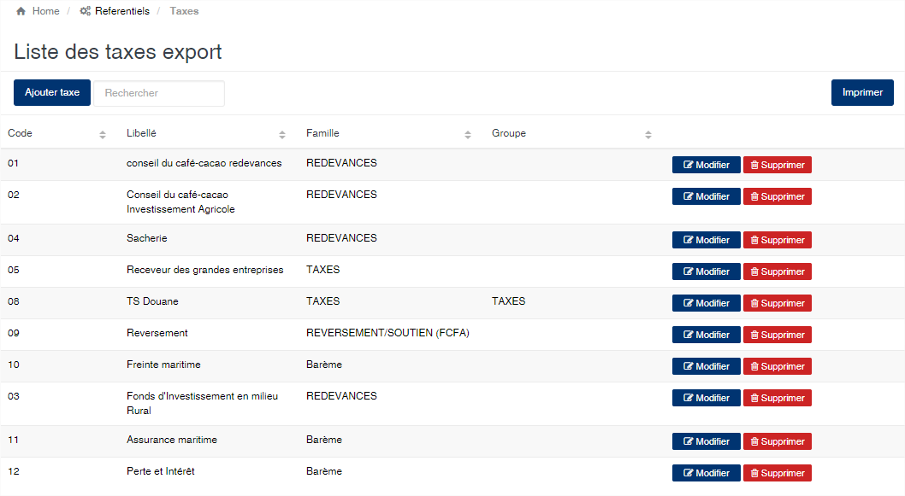
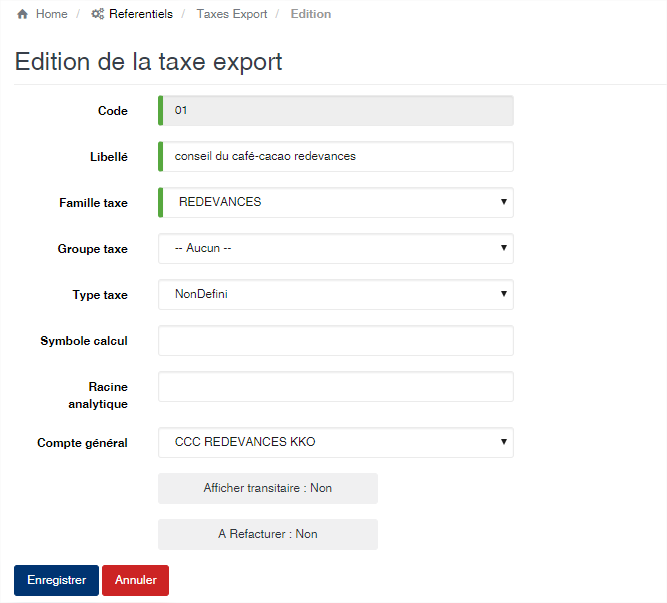

# Taxe

Cette option permet de gérer les taxes à utiliser lors de la génération de la formule provisoire.

### **Edition de la fiche : Taxe export**

Les zones obligatoires à remplir sont le code, le libellé et la famille.

* **Code** : indiquez le code de la taxe. Ce code doit être unique dans l'application.
* **Libellé** : indiquer la désignation de taxe.
* **Famille taxe** : sélectionnez la :doc:`famille de taxe <familleTaxe>` à laquelle appartient cette taxe.
* **Groupe de taxe** : sélectionnez le :doc:`groupe <groupeTaxe>` auquel appartient la taxe. Ce groupe est facultatif. Il est utilisé afin de regrouper les taxes sur l'édition du rapport de la formule provisoire.
* **Type taxe** : sélectionnez le type dans la liste déroulante.  Cette zone est facultative.
* **Symbole calcul** : indiquez une valeur quelconque pour représenter cette taxe lors la définition des formules de calcul de la formule provisoire.
* **Racine analytique** : indiquez le compte analytique associé à cette taxe.
* **Compte général** : indiquez le :doc:`compte général <compteGeneral>` associé à cette taxe.

