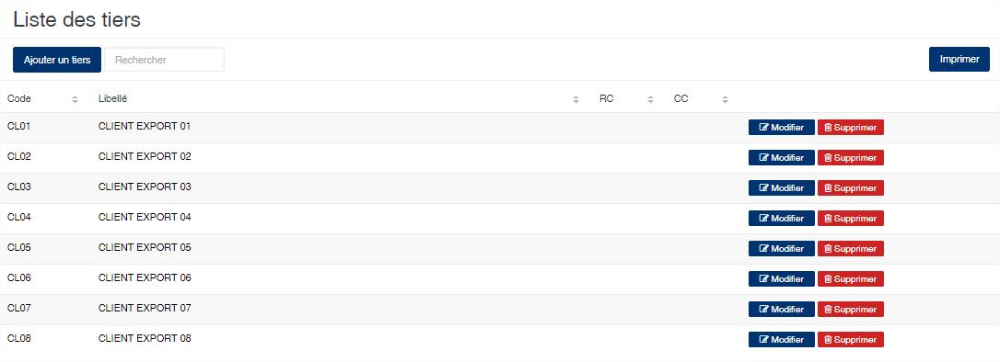
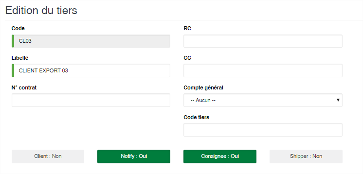
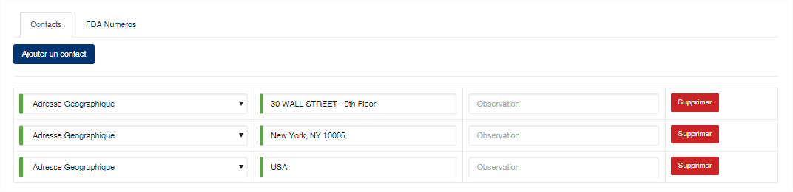
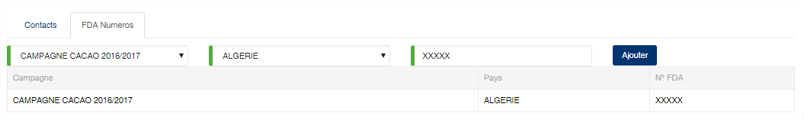

# Tiers

Cette option permet de gérer les clients export.

### **Edition de la fiche : Tiers**

Toutes les zones de cette fiche doivent obligatoirement être renseignées.

* **Code** : indiquez le code du tiers
* **Libellé** : indiquez la raison sociale du tiers
* **RC** : N° de registre de commerce du tiers
* **CC** : N° de compte contribuable du tiers
* **N° contrat** : indiquez le numéro de contrat export
* **Compte général** : sélectionnez le compte général associé au tiers
* **Code tiers** : indiquez le compte tiers.
* **Client (Oui/Non)** : Activé, cela indique que le tiers est un client.
* **Notify (Oui/Non)** : Activé, cela indique que le tiers peut apparaître en tant que notify sur les OT et Bill of Lading.
* **Consignee (Oui/Non)** : Activé, cela indique que le tiers peut apparaître en tant que consignee sur les OT et Bill of Lading
* **Shipper (Oui/Non)** : Activé, cela indique que le tiers peut apparaître en tant que shipper sur les OT et Bill of Lading

**Onglet Contact**

Cet onglet vous permet d'indiquer les contacts du tiers

