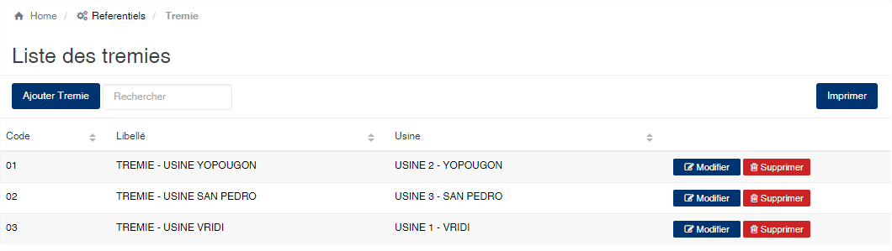
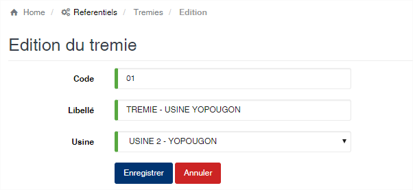

# Trémie

Cette option permet de gérer les trémies utilisées lors de la mise en fosse de produit dans le module usinage.

### **Edition de la fiche : Trémie**

Toutes les zones de cette fiches sont obligatoires.

* **Code** : indiquez le code la trémie. Ce code doit être unique dans l'application.
* **Libellé** : indiquez la désignation de la trémie.
* **Usine** : sélectionnez l'usine à laquelle la trémie est rattachée.

