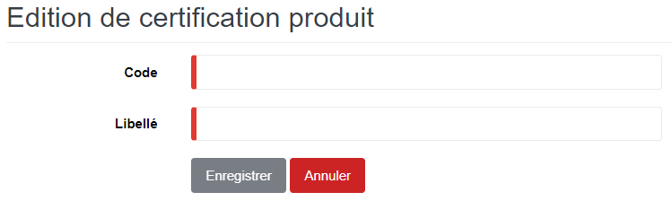

# Type Certification

Cette option permet de définir les types de certification des produits.

### **Edition de la fiche : Type certification**

les zones ci-dessous de cet écran sont obligatoires.

* **Code** : Indiquez le code.
* **Libellé** : Indiquez le libellé.

