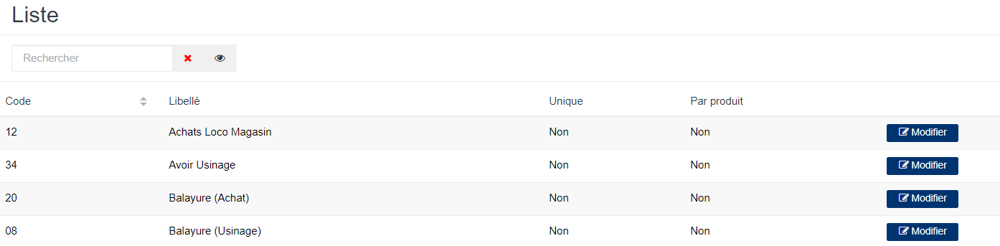
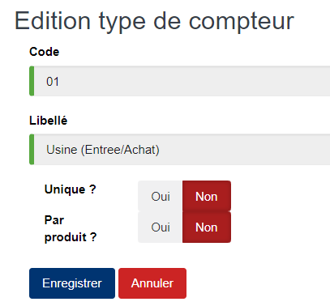

# Type Compteur

Cette option permet de définir les types de compteur.

### **Edition de la fiche : Type compteur**

les zones ci-dessous de cet écran sont obligatoires.

* **Code** : Indiquez le code.
* **Libellé** : Indiquez le libellé.
* **Unique ?** : Oui, elle indique l'unicité du type de compteur.
* **Par Produit ?** : Oui, elle indique que le type de compteur est généré par produit.

