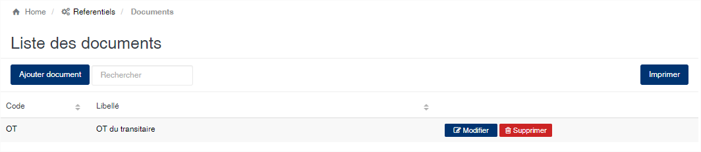
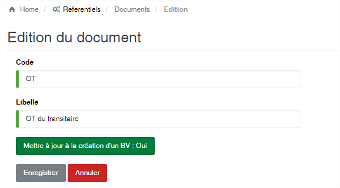

# Type de documents

Cette option permets de gérer la liste des documents constituants les dossiers d'exportation de produits.

### **Edition de la fiche : Type de documents**

Toutes les zones de cette fiche sont à remplir obligatoirement.

* **Code** : indiquez le code du document.&#x20;
* **Libellé** : indiquer la désignation du document.

