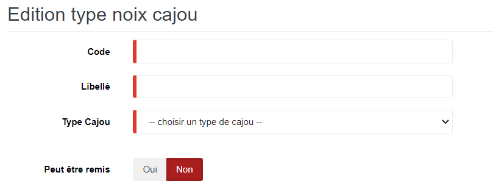
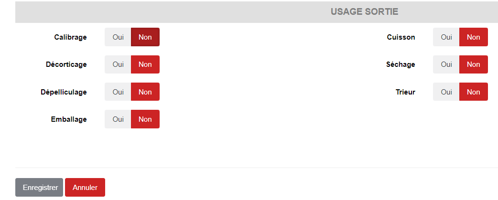

# Type Noix Cajou

Cette option permet de définir les types de noix de cajou utilisés dans la transformation du Cajou.

### **Edition de la fiche : Type noix cajou**

L'écran d'édition de type noix de cajou se divise en trois parties.

**1ère partie** : Elle vous permet d'indiquer les types de noix de cajou.

les zones ci-dessous de cet écran sont obligatoires.

* **Code** : Indiquez le code.
* **Libellé** : Indiquez le libellé.
* **Type Cajou** : Indiquez le type de cajou.
* **Peut être remis** : Oui, elle indique que le type de noix peut être remis dans le processus de la transformation.

**2ème partie - Usage Entrée** : Elle vous permet d'indiquer les processus suivi par les types de noix au cours de la transformation.

* **Calibrage** : Oui, elle indique que le type de noix subit le processus de calibrage.
* **Cuisson** : Oui, elle indique que le type de noix subit le processus de cuisson.
* **Décorticage** : Oui, elle indique que le type de noix dans le processus du décorticage.
* **Séchage** : Oui, elle indique que le type de noix subit le processus de séchage.
* **Dépélliculage** : Oui, elle indique que le type de noix subit le processus de dépélliculage.
* **Trieur** : Oui, elle indique que le type de noix subit le processus de triage .
* **Emballage** : Oui, elle indique que le type de noix subit le processus d'emballage.

.PNG>)

**3ème partie - Usage Sortie** : Elle vous permet d'indiquer les processus suivi par les types de noix au cours de la transformation.

* **Calibrage** : Oui, elle indique que le type de noix subit le processus de calibrage.
* **Cuisson** : Oui, elle indique que le type de noix subit le processus de cuisson.
* **Décorticage** : Oui, elle indique que le type de noix dans le processus du décorticage.
* **Séchage** : Oui, elle indique que le type de noix subit le processus de séchage.
* **Dépelliculage** : Oui, elle indique que le type de noix subit le processus de dépelliculage.
* **Trieur** : Oui, elle indique que le type de noix subit le processus de triage .
* **Emballage** : Oui, elle indique que le type de noix subit le processus d'emballage.

