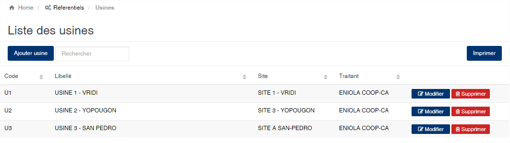
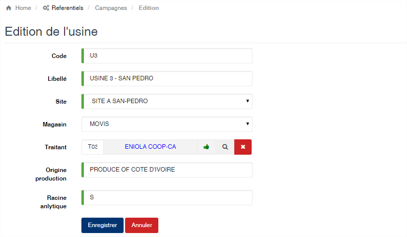

# Usine

Cette option permet de gérer les usines ou des centres d'achats, où se font les opérations.

### **Edition de la fiche : Usine**

Les zones **Code**, **Libellé** et **Site** sont obligatoires.

* **Code** : indiquez le code de l'usine. Le code doit être unique.
* **Libellé** : indiquez la désignation de l'usine.
* **Site** : sélectionnez le site associé à l'usine.
* **Magasin** : sélectionnez le magasin associé à l'usine. Cette zone est facultative. Si un magasin est sélectionné, il sera automatiquement utilisé comme lieu de stockage des lots lors de la production.&#x20;
* **Traitant** : sélectionnez le fournisseur associé à l'usine. Cette zone est facultative. Les informations du fournisseur seront utilisées pour la génération des écritures comptables imputables à l’usine.
* **Origine production** : précisez le libellé indiquant l'origine des produits lors de l'export. Cette mention sera affiché sur les factures et les BL dans le module shipping.
* **Racine analytique** : en fonction de votre schémas de comptabilisation, veuillez éventuellement indiquer ici l'analytique associé à l'usine.

