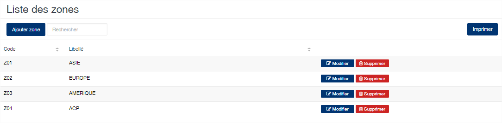
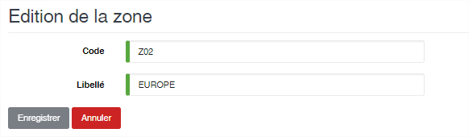

# Zone

Cette option permet l'enregistrement des zones de destination des produits à l'export.

### **Edition de la fiche : Zone**

Toutes les zones sur cette fiche doivent être renseignées obligatoirement

* **Code** : indiquez le code de la zone
* **Libellé** : indiquez la désignation de la zone

