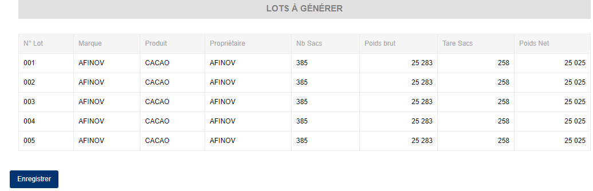

# Génération Lots (Préproduction)

## **Edition de la fiche :** Génération des lots fictifs

L'écran d'édition de la génération de lot se divise en 2 parties.

**1ère partie** : Elle vous permet d'indiquer les informations élémentaires sur la tranche de lot et le nombre de lot à générer.

Certaines zones ci-dessous de cet écran sont obligatoires.

* **Tranche de lot** : indiquez la tranche de lot.
* **Nb. fictifs à générer :** : indiquez le nombre de lot à générer.
* **Générer** : Cliquez sur ce le bouton **Générer** pour créer les lots.

.PNG>)

**2ème partie** : Elle vous affiche la liste des lots à générer.

