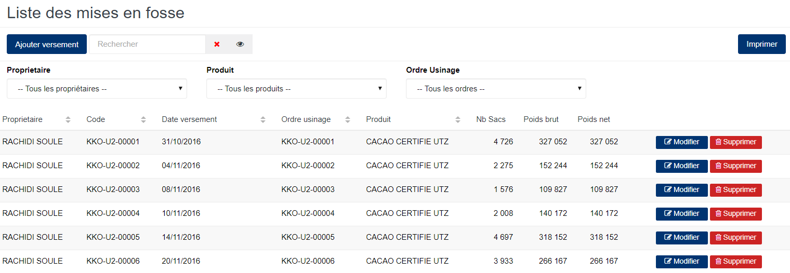
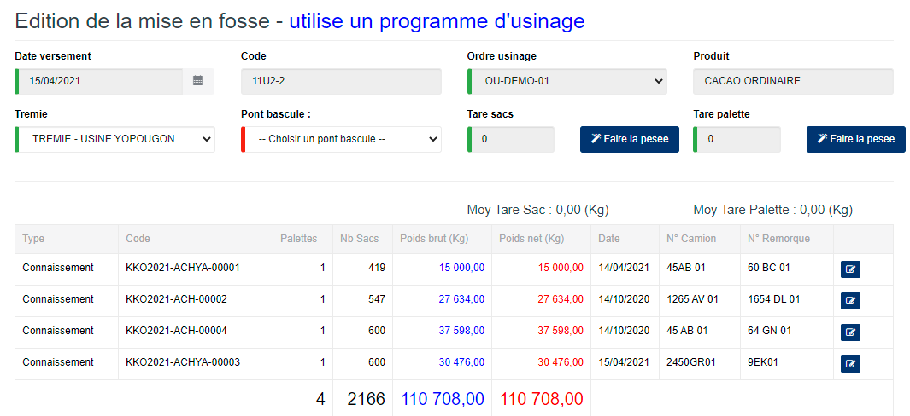

# Mise en fosse

Cette fonctionnalité vous permet de gérer les déversements des stocks de produit brousse dans les trémies(silos).

## **Edition de la fiche :** Mise en fosse

les zones ci-dessous de cet écran sont obligatoires.

* **Date versement** : indiquez la date de l'opération.
* **ordre usinage** : indiquez l'ordre d'usinage.
* **Trémie** : indiquez la trémie.
* **Pont bascule** : indiquez le pont bascule ou pèse palette.
* **Tare sacs** : indiquez la tare des sacs.
* **Tare palette** : indiquez la tare des palettes.
* **Type de versement** : choisir le type de versement.

