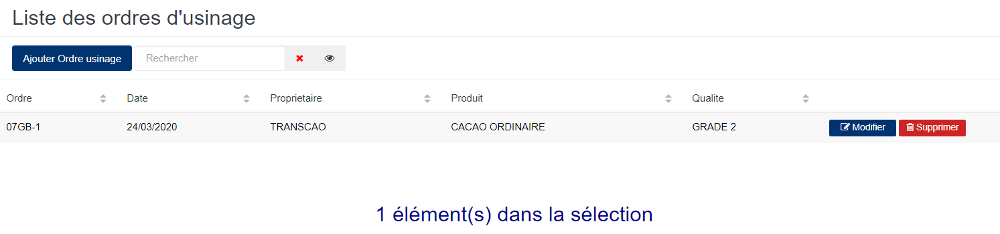
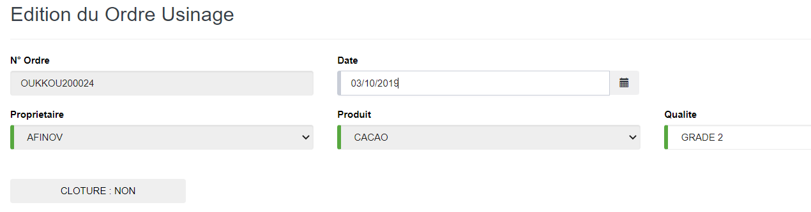
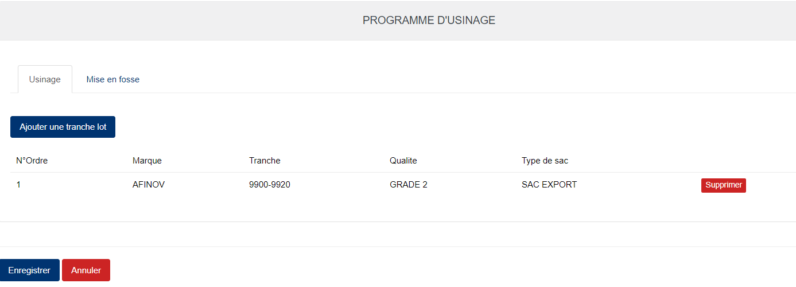
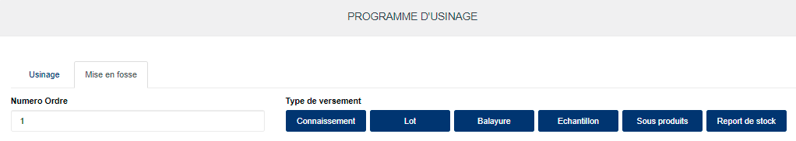

# Ordre d'usinage

Cette fonctionnalité vous permet d'identifier chaque opération de fabrication de lot par un code (indice de démarrage) qui servira dans le calcul de la freinte d'usinage.

## **Edition de la fiche : Ordre d'usinage**

L'écran d'édition de l'ordre d'usinage se divise en 3 parties. Ces trois parties sont nécessaire dans le cas d'utilisation d'un **programme d'usinage**.

**1ère partie** : Elle vous permet d'indiquer les informations élémentaires sur l'ordre d'usinage

Certaines zones ci-dessous de cet écran sont obligatoires.

* **N° Ordre** : indiquez le numéro d'ordre d'usinage (Ce numéro doit être unique pendant une campagne).
* **Date** : indiquez la date de saisie.
* **Propriétaire** : indiquez le propriétaire du produit.
* **Produit** : indiquez le produit.
* **Qualité** : indiquez la qualité du produit.
* **Clôture** : "**Oui**", elle indique que cet ordre d'usinage est clôturé.

**2ème partie** : Elle vous permet d'associer des tranches de lot à l'ordre d'usinage.

* **Ajouter une tranche lot** : Cliquez sur ce le bouton **Ajouter une tranche lot** pour choisir une tranche de lot à associer.

**3ème partie** : Elle vous permet d'associer des types de stock(stocks brousse, lot, balayures etc.) à utiliser pour le mélange.

* **Numéro Ordre** : indiquez la numérotation
* **Connaissement** : Cliquez sur ce le bouton **Connaissement** pour choisir un stock brousse à associer.
* **Lot** : Cliquez sur ce le bouton **Lot** pour choisir un lot à associer.
* **Balayure** : Cliquez sur ce le bouton **Balayure** pour choisir un stock de balayure à associer.
* **Echantillon** : Cliquez sur ce le bouton **Echantillon** pour choisir un stock d'échantillon à associer.
* **Sous produits** : Cliquez sur ce le bouton **Sous produits** pour choisir un stock de sous produits à associer.
* **Report de stock** : Cliquez sur ce le bouton **Report de stock** pour choisir un report de stock à associer.

