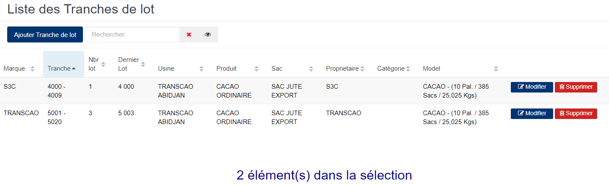
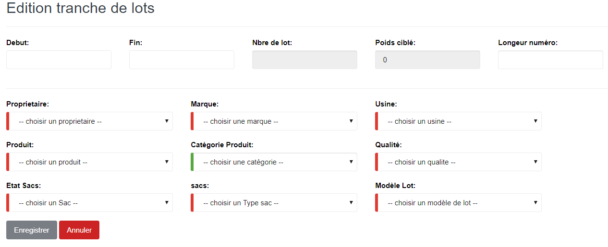

# Tranche de lot

Cette fonctionnalité vous permet de créer les tranches de lot dans lesquelles les lots sont fabriqués.

## **Edition de la fiche : Tranche de lot**

les zones ci-dessous de cet écran sont obligatoires.

* **Début** : indiquez le **premier** numéro de la tranche de lot.
* **Fin** : indiquez le **dernier** numéro de la tranche de lot.
* **Propriétaire** : indiquez le propriétaire du produit.
* **Marque** : indiquez la marque du produit.
* **Usine** : indiquez l'usine de production
* **Produit** : indiquez le produit.
* **Qualité :** indiquez la qualité prévue
* **Etat Sacs** : indiquez l'état des sacs.
* **Sacs** : indiquez le type de sac.
* **Modèle Lot** : indiquez le modèle de lot.

