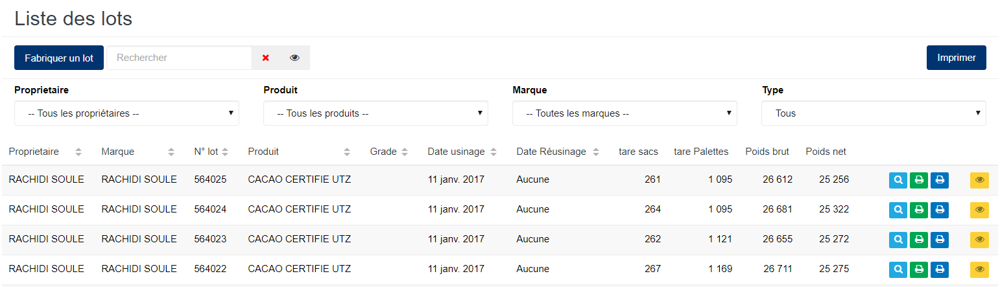
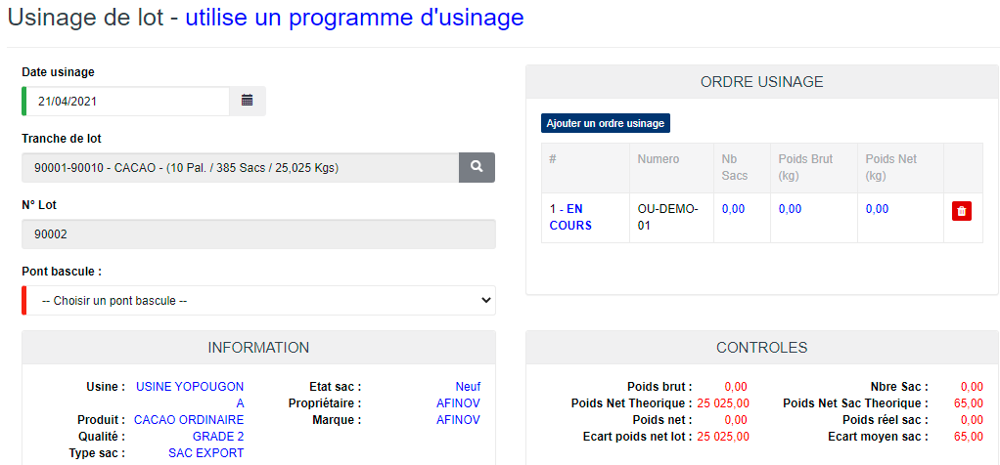
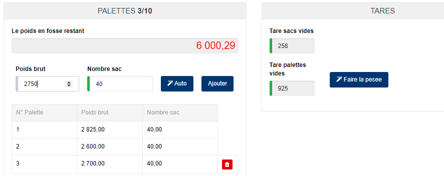

# Usinage de lot

Cette fonctionnalité vous permet de fabriquer les lots , suivant le processus de fabrication dans l'usine.

## **Edition de la fiche :** Usinage de lot

L'écran d'édition de l'usinage de lot se divise en 2 parties.

**1ère partie** : Elle vous permet d'indiquer les informations liées au programme d'usinage.

Certaines zones ci-dessous de cet écran sont obligatoires.

* **Date usinage** : indiquez la date de fabrication de lot.
* **Ajouter un ordre usinage** : Cliquez sur ce le bouton "**Ajouter un ordre usinage"** pour choisir un ordre d'usinage.
* **Tranche de lot** : Cliquez sur ce bouton  pour choisir une tranche de lot.
* **Pont bascule** : indiquez la pèse palette.

**2ème partie** : Elle vous permet de saisir les palettes du lot.

Certaines zones ci-dessous de cet écran sont obligatoires.

* **Tare sacs vides** : cliquez sur ce le bouton **faire la pesée** pour capter le poids des sacs vides ou saisir le poids manuellement
* **Tare palettes vides** : Cliquez sur ce le bouton **faire la pesée** pour capter le poids des palettes vides ou saisir le poids manuellement
* **poids brut** : cliquez sur ce le bouton **Auto** pour capter le poids ou saisir le poids manuellement.
* **Nombre sac** : indiquer le nombre de sac.
* **Ajouter** : cliquez sur ce le bouton **Ajouter** pour prendre en compte le poids total de la palette. Et passer ensuite à une autre palette.

