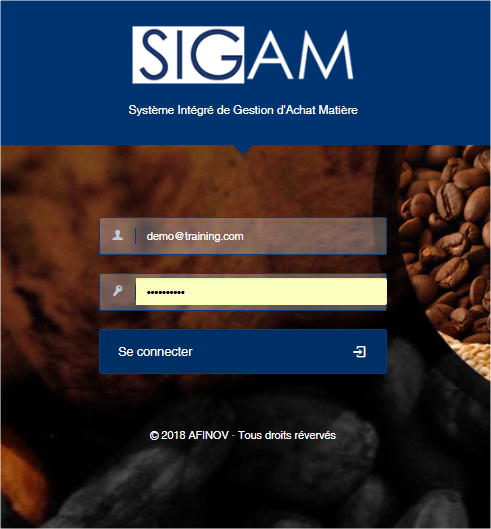
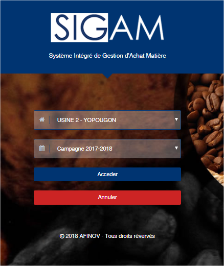

# Ouverture de session

Pour accéder à SIGAM, veuillez ouvrir dans votre navigateur internet l’adresse qui vous a été communiquer lors de la création votre instance de SIGAM. Après le chargement de l’application vous accéder à l’écran d’ouverture de sessions.


&#x20;Tout utilisateur de SIGAM doit disposer d’un profil utilisateur. Veuillez-vous rapprocher de votre administrateur afin de récupérer vos paramètres de connexion..


**La connexion à SIGAM se fait en deux étapes :**

**Etape 1 :**

* Veuillez indiquer votre email de connexion qui vous a été communiqué par votre administrateur
* Ensuite indiquez le mot de passe.
* Puis, cliquez sur le bouton **Se connecter**

**Etape 2 :**

* Sélectionnez l’usine sur laquelle vous souhaitez travailler
* Sélectionnez la campagne sur laquelle vous voulez travailler
* Puis cliquer sur le bouton **Accéder**


Sigam est une application multi-utilisateurs, multi-usines et multi-campagnes. L’accès aux usines et aux campagnes dépendront des droits qui vous aurons été accordés.

