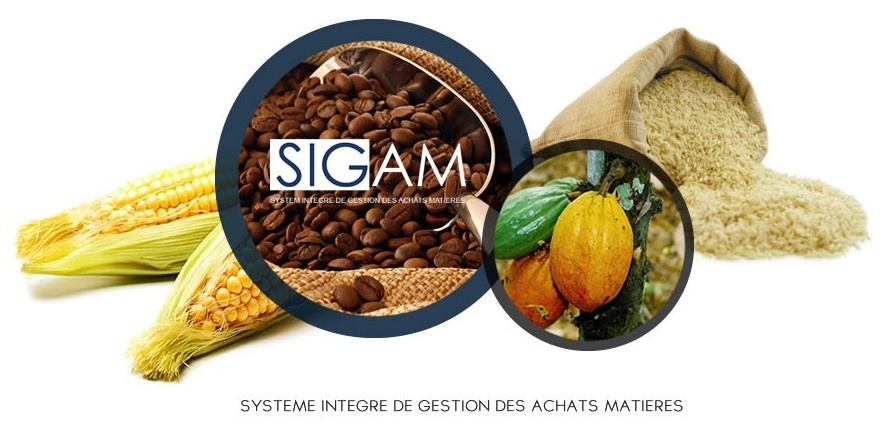

# Propriété & Usage

Tout usage, représentation ou reproduction intégral ou partiel, fait sans le consentement d’AFINOV est illicite. Ils constitueraient une contrefaçon. SIGAM est un logiciel original développé par AFINOV Sarl. Toute utilisation, à quelque titre que ce soit, non autorisée dans le cadre du contrat de licence, est strictement interdite sous peine de sanctions pénales. Contenu:

### Conformité du manuel et Mise en garde

En raison des contraintes inhérentes à la présentation sous forme de manuel électronique, les spécifications et fonctionnalités décrites dans le présent manuel constituent une illustration aussi proche des fonctionnalités de l’application au moment de la rédaction de ce guide. Il appartient au client, parallèlement à la documentation, de faire usage du logiciel afin de mesurer l’adéquation de ses besoins aux fonctionnalités. Il est important, pour une utilisation sûre et opérationnelle du logiciel, de lire au préalable la documentation.
